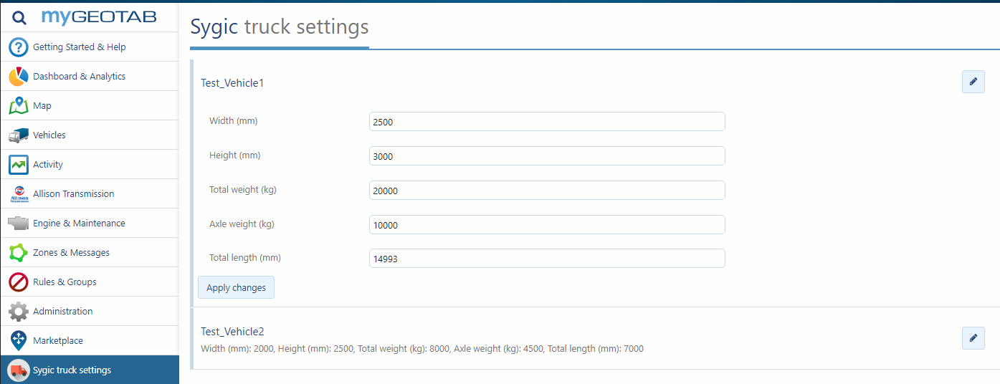
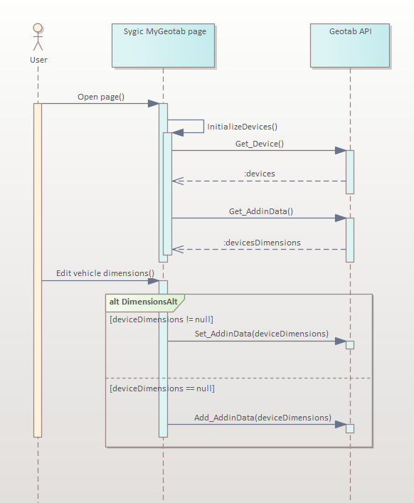
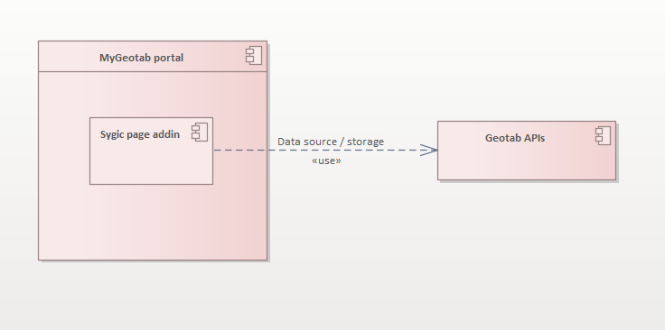
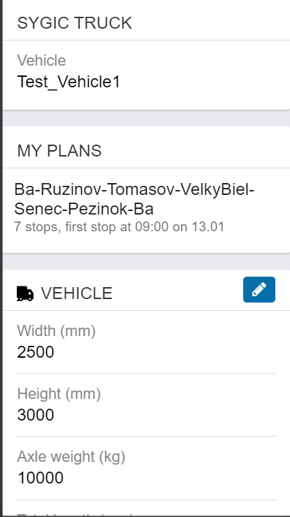
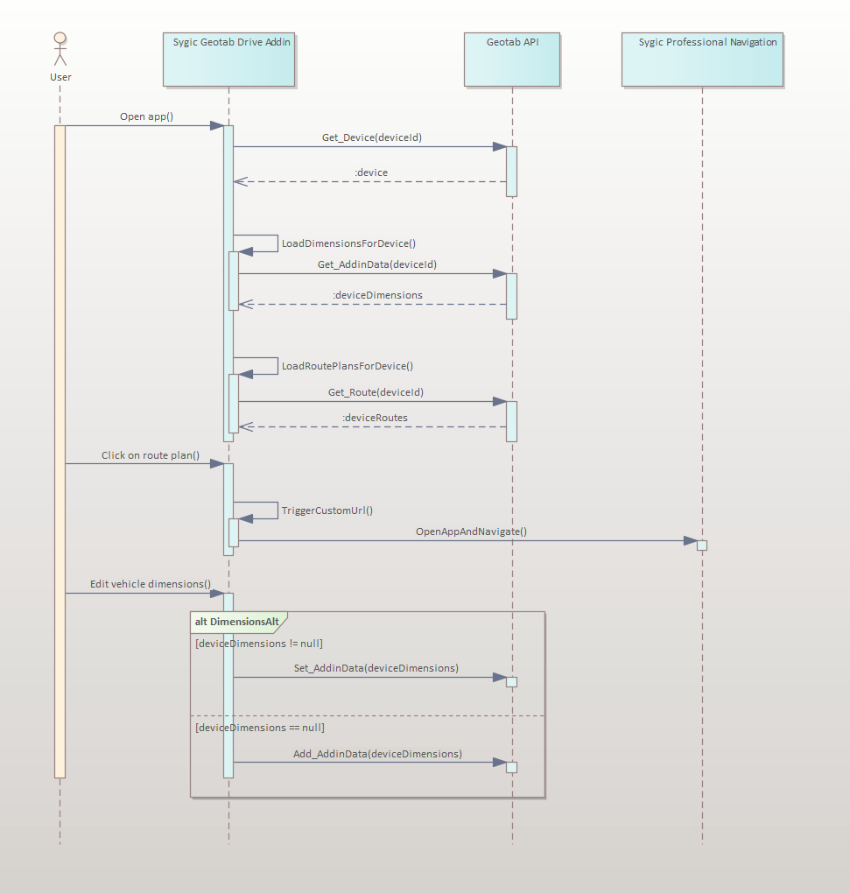
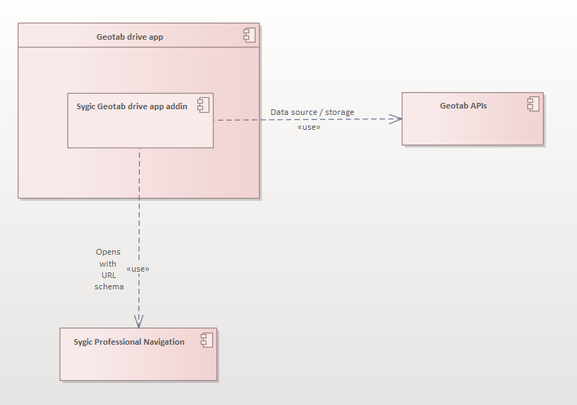
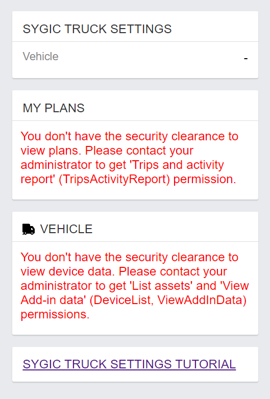

# Development guide

Clone repository. Navigate in respective addon directory ([geotabdrive-sygic-addin](geotabdrive-sygic-addin) or [mygeotab-sygic-page](mygeotab-sygic-page))

### Before you start
To ensure proper sygic-geotab-utils module inclusion in both projects you need to:

1. ```cd ~/sygic-geotab-utils && npm link```
2. ```cd ~/mygeotab-sygic-page && npm link sygic-geotab-utils```
3. ```cd ~/geotabdrive-sygic-addin && npm link sygic-geotab-utils```
4. ```cd ~/sygic-geotab-utils && npm run compile```

### Run and develop
To run locally run following in respective folders:

```
npm install
npm run serve
```
## Deployment
1. To increase solution _version_ go to [package.json](package.json) and increase the _version_ property. This version will be used in all addons in step 2.
2. To build for production run following command in root folder. It will run respective build scripts for geotabdrive addins and mygeotab page.
```
npm run build
```
3. The _version_ from step 1 is updated in all addons' respective package.json files. [geotabdrive-sygic-addin/package.json](geotabdrive-sygic-addin/package.json), [mygeotab-sygic-page/package.json](mygeotab-sygic-page/package.json), [geotabdrive-start-sygic-addin/package.json](geotabdrive-start-sygic-addin/package.json)
4. Build script from step 3 will create two files:
    1. a combined config [dist/latest/truck-settings-config.json](dist/latest/truck-settings-config.json) for geotabdrive and mygeotab _Sygic Truck Settings_ addins.
    2. single config [dist/latest/start-sygic-config.json](dist/latest/start-sygic-config.json) for _Start Sygic Truck_ geotab drive button addin. 
    3. tagged release config versions in [dist/1.1.9/start-sygic-config.json](dist/1.1.9/start-sygic-config.json) and [dist/1.1.9/truck-settings-config.json](dist/1.1.9/truck-settings-config.json)
5. Push to github. [Create a release on github](https://docs.github.com/en/repositories/releasing-projects-on-github/managing-releases-in-a-repository) with specified version tag (e.g. _1.1.9_).
6. Files from step 4. point iii. should be used when installing addon to my.geotab.com. We recommend to use concrete version (e.g. _1.1.9_) configuration instead of relying on latest.

## Geotab login credentials
1. You need to have an account at the testing server https://my1291.geotab.com/
2. Login with your username + password and use sygic_test DB when prompted.

## Geotab documentation reference
https://geotab.github.io/sdk/software/guides/developing-addins/

# Architecture and functionality overview
## My Geotab Sygic Page

This page allows you to set dimensions of 'Devices' ([see here](mygeotab-sygic-page/src/app/scripts/main.js#L232)).

To install the page in mygeotab UI use this [config.json](dist/latest/truck-settings-config.json)



### Sequence diagram



### System architecture diagram



## Geotab Drive Sygic Addin

This addin allows you to use [Sygic Professional Navigation](https://www.sygic.com/enterprise/professional-gps-navigation-sdk) to navigate to assigned 'Routes' of type 'Plan' to your 'Device' in the future (starting from now) ([see here](https://github.com/Sygic/sygic.github.io/blob/master/geotab/geotabdrive-sygic-addin/src/app/scripts/main.js#L189))

To install the addin in Geotab Drive APP use this [config.json](dist/latest/truck-settings-config.json)



### Sequence diagram



### System architecture diagram



## Security and access rights

To view vehicles in the list a user must have **"List assets"** (securityIdentifier: DeviceList) and **"View Add-in data"** (securityIdentifier: ViewAddInData) feature access in his security clearance. Without this permissions the addin will display a warning.

To modify vehicle dimensions a user must have **"Administer assets"** (securityIdentifier: DeviceAdmin) and **Manage Add-in data** (securityIdentifier: ManageAddInData) feature access in his security clearance. Without this permissions the addin will not allow to change vehicle dimensions.

To view vehicle assigned Route plans in Geotab Drive Sygic Addin a user must have **"Trips and activity report"** (securityIdentifier: TripsActivityReport) feature access in his security clearance and be an assigned **Driver**. Without this permission the addin will display a warning."



Contact: [os-team@sygic.com](mailto:os-team@sygic.com)